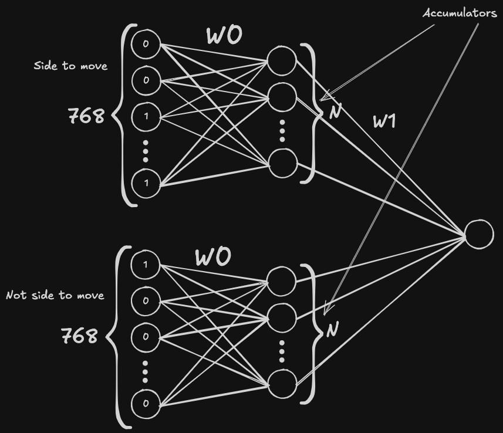

It would help a lot if you know about feedforward neural networks and/or SIMD.

## NNUE idea
The basic network is a feed-forward network with $1$ hidden layer. The input layer's size is $768 = 2 \cdot 6 \cdot 64$ (a neuron for every color, every piece, and every square, which is $1$ when the piece is on that square, and $0$ otherwise).

The problem with this network is that you need to do a forward pass every time you evaluate a position, which is very slow. To eliminate that, we use UE — efficient updates. When a move is made, only a few of the input neurons change their value, and we can quickly recalculate the hidden layer. Another problem is that when we need to evaluate the position for black, we must "flip" the board. Because we need to be able to evaluate the position for both colors, we store the calculated hidden layer for both white and black at the same time.

## Basic architecture
The basic NNUE architecture is $(768 \rightarrow 2N \rightarrow 1)$, where $N$ is the size of the hidden layer. We store $2$ accumulators, each of size $N$.


## Updating
The formula to calculate the value of the $i$-th hidden neuron is:
$$acc_i = b0_i + \sum_{j=1}^{768} a_j \cdot w0_{ij}$$
where $a$ is the vector of input neuron values, $w0$ are the hidden layer weights, and $b0$ is the vector of hidden layer biases. 

When an input neuron changes its value (let's say $a_s$ becomes $1$), we iterate over both accumulators and update them. In the formula above, the only term that changes is $a_s \cdot w0_{is}$, so we add this value to $acc_i$. But because we need to support both accumulators, we update `acc_white` and `acc_black`. The index of the changed neuron is different for each, `idx_white` and `idx_black` respectively (they correspond to the same square; the difference is perspective — square b3 for white is g6 for black).

The pseudocode:
``` python
def update(idx_white, idx_black):
	for i in 0..N-1:
		acc_white[i] += w0[idx_white][i]
		acc_black[i] += w0[idx_black][i]
```
The same logic applies when the neuron becomes $0$ — we just subtract $a_s \cdot w0_{is}$.

## Evaluation
When we evaluate a position, we have already calculated accumulators for both colors. Let's assume it's white's turn for simplicity. We could use only white's accumulator, but we actually use both because black's accumulator provides additional information that improves evaluation quality.

To get an activated hidden layer, we **concatenate** the accumulators (first white, then black), getting a layer of size $2N$, and then apply activation function to it. The most common activation function for NNUE is SCReLU (Squared Clipped ReLU), which is just $\text{clamp}(value, 0, 1)^2$, where $\text{clamp}(x, l, r)$ is basically $\text{max}(l, \text{min}(r, x))$ (for black's turn, the logic is the same, but we concatenate first black and then white). 

After we get the activation of the hidden layer, we can calculate the output neuron (which is also the evaluation of the position):
$$o = b1 + \sum_{i=1}^{2N} act_i \cdot w1_i$$
where $w1$ is the vector of output weights and $b1$ is the output bias.

## Quantization
We could use floats for calculating the evaluation, but they have two major problems: when you do a lot of updates, the error from floats accumulates and can become significant. The second problem is that `float` is usually 32 bits wide, and because you will want to use SIMD for the net, narrowing the numbers to 16 or 8-bit will result in much faster code. Because of these problems, we use an important trick: **quantization**.

Imagine that we want to multiply $a$ and $b$ ($c = a \cdot b$), where $a$ is in the range $[0, 1]$. We could just use floats, but since we are using ints, we do this:
$a1 = a \cdot Q$
$c1 = \frac{a1 \cdot b}{Q}$
which is almost the same as $c$, eliminating the need for floating-point arithmetic.

Let's imagine we have only 1 neuron in all three layers. $w0$, $b0$, $w1$, and $b1$ are now numbers instead of vectors. Let $v$ be the input neuron activation.
The hidden layer neuron value is $x1 = v \cdot w0 + b0$, and activation is $a1 = \text{clamp}(x1, 0, 1)$. Output neuron value is $o = a1 \cdot w1 + b1 = \text{clamp}(v \cdot w0 + b0, 0, 1)^2 \cdot w1 + b1$

When we are saving our trained net, we quantize the weights and biases:
$w0 \mathrel{*}= Q_a$
$b0 \mathrel{*}= Q_a$
$w1 \mathrel{*}= Q_b$
$b1 \mathrel{*}= Q_a \cdot Q_b$
And the formula becomes
$$o = \frac{\text{clamp}(v \cdot w0 + b0, 0, Q_a)^2 \cdot w1}{Q_a} + b1$$
And the evaluation is $$\text{eval} = \frac{o \cdot S}{Q_a \cdot Q_b}$$
The usual values are $Q_a = 255, Q_b = 64, S = 400$. $Q_a$ and $Q_b$ are chosen to fit all the quantized values into 16-bit integers, $S$ is just a constant which scales $\text{eval}$ to a reasonable range, making it comparable with centipawns. We lose some precision when doing quantization, but it doesn't affect the evaluation enough to lose playing strength.
###### Pseudocode
```python
Qa = 255
Qb = 64
S = 400

def evaluate(color):
	if color == WHITE:
		L2 = concatenate(acc_white, acc_black)
	else:
		L2 = concatenate(acc_black, acc_white)
		
	for i in 0..2N-1: #Hidden layer activation
		L2_act[i] = clamp(L2[i], 0, Qa) ** 2
		
	eval = 0
	for i in 0..2N-1:
		eval += L2_act[i] * w1[i]
	
	eval /= Qa
	eval += b1
	eval *= S
	eval /= Qa * Qb
	return eval
```

## Implementation tips
You should filter out all noisy positions (the best move is a capture, the side to move is in check, etc.).
If you choose some $N$, the minimum number of positions you need to train your net on is about $N$ million (keep in mind that usually about half of the positions are filtered out). In the beginning, you should choose $N=16$ or $N=32$, because it's probably sufficient to outperform your handcrafted evaluation.
Always test every change (for example, if you generated some new data, **first** you test the same network as before, trained on new data, **and only then** you try to change it (increase N, etc.)). $N$ should be a power of $2$ for SIMD to work.

The best tool to train your nets is [Bullet](https://github.com/jw1912/bullet)  with [ViriFormat](https://crates.io/crates/viriformat) file system. The best way is to code internal datagen that writes data directly into viriformat, but the easier way is to run a lot of games with fastchess/cutechess and save all games into PGN; after that you can use [Pawnocchio](https://github.com/JonathanHallstrom/pawnocchio) chess engine to convert it to ViriFormat file. In Bullet you need to choose Viriformat binpack loader, and it also includes all the filtering.