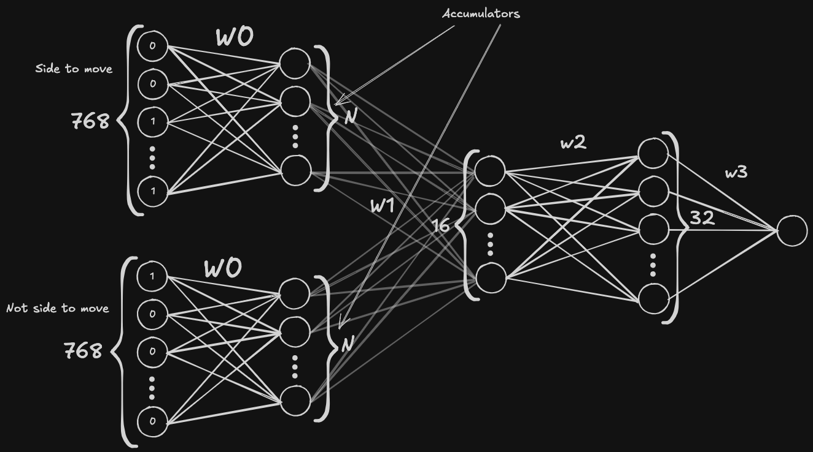

Instead of using only one hidden layer in our net, we use more.
The most common architecture for a multilayer network is $(768 \rightarrow N)\text{x}2 \rightarrow 16 \rightarrow 32 \rightarrow 1$.
The quality of evaluation increases a lot, but we get a big performance hit.
To propagate the first hidden layer further, we now need $16\times$ more time because the number of neurons on the next layer increases $16\times$.
However, there is a clever algorithm which allows us to evaluate the net without a considerable performance hit.
Every hidden layer's activation function is still SCReLU except the last one (size $32$); its activation function is CReLU (Clipped ReLU), which is just $\text{clamp}(x, 0, 1)$.

Just like in output buckets, number of weights doesn't increase a lot, so we don't need more data to train a multilayer net.

## The algorithm

It's described very well in [this](https://aletheiaaaaa.github.io/posts/2025-07-14-dpbusd-explained/) article.

## Quantization

You only need to quantize the first hidden layer (with the reasons described in Basic NNUE).
You can do floats for later layers, but you can get some floating-point inconsistencies (e.g. different bench on different platforms), so I prefer to quantize the whole net.
The constants are: $Q0=255, Q1=128, Q=64$. The quantization of each parameter is:

| Parameter    | Quantization |
| ------------ | ------------ |
| $w0,b0$      | $Q0$         |
| $w1$         | $Q1$         |
| $b1, w2, w3$ | $Q$          |
| $b2$         | $Q^3$        |
| $b3$         | $Q^4$        |

Just like in the basic NNUE, the accumulators end up fitting into 16 bits (quantized as $Q0$). $Q1$ needs to be $128$ instead of $255$, because in early versions of ARM the SIMD instruction uses signed int8 arithmetic, so you need it to fit into $2^7$.
After activation they get quantized as $Q0^2$.
However, when we compute next layer, we need the values of the accumulators' activations values to fit into 8-bit numbers.
To do it, we divide the activations by the least possible power of $2$: $\frac{Q0^2}{2^9}<2^{7}$; (we do it with `_mm256_mulhi_epi16` SIMD instruction: $\text{act} =\text{mulHigh16}( \text{shiftLeft16(acc, 7)}, acc)$, where `mulHigh16` is multiplication in 16-bit numbers and keeping the high part, which is effectively doing /= $2^{16}$, so it ends up in $\text{act} =\frac{\text{acc}^2 \cdot 2^7}{2^{16}} = \frac{\text{acc}^2}{2^{9}}$).
After this we end up with $\frac{Q0^2 \cdot Q1}{2^9}$ quantization; however, we want $Q$ quantization.
To do that, we must multiply our values by $Q \cdot \frac{2^9}{Q0^2 \cdot Q1} \approx \frac{1}{2^8}$, so we just shift the values right by $8$.
The rest is easy: we propagate the values further (without any fancy algorithms, just plain matmul with SIMD because $16 \cdot 32$ is small compared to $2N \cdot 16$), ending up with $Q^4$ quantization.
Then we multiply the result by $\frac{S}{Q^4}$, and the evaluation is done!
A good rule of thumb is that when you're activating a layer, it's clamped in the range $[0; X_b]$ where $X_b$ is the quantization constant of that layer's bias.

#### Output buckets

If you're doing multilayer, you've probably done output buckets, so remember that all weights and biases from $w1$ and $b1$ onward have output buckets.
