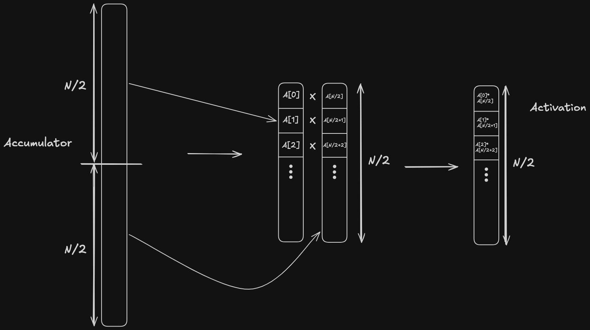
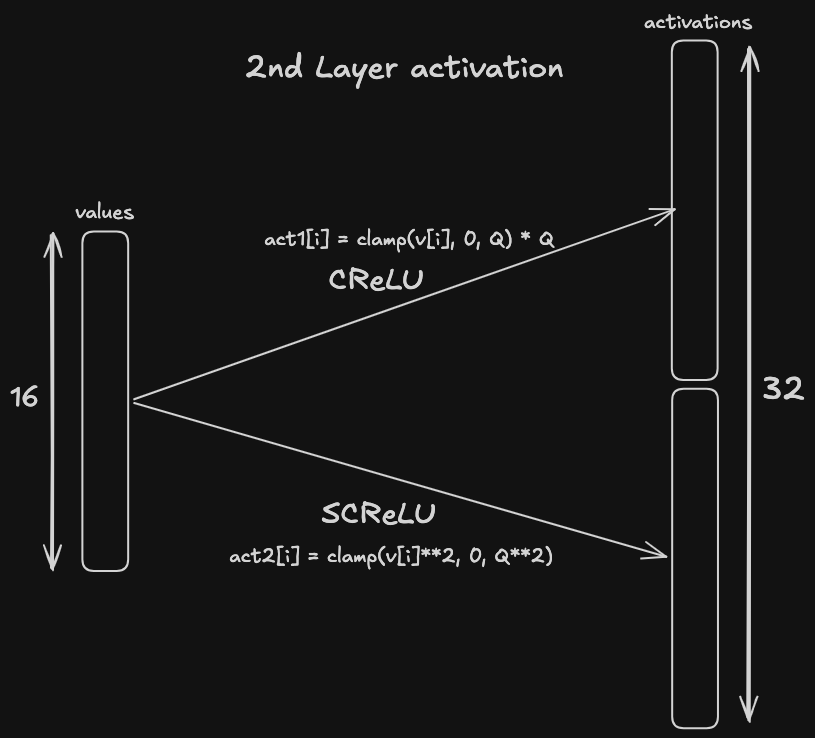

## Pairwise multiplication

There is another good [article](https://cosmo.tardis.ac/files/2024-08-17-multilayer.html#pairwise-multiplication) on this topic.

Generally, when activating an accumulator of size $N$, you end up with an activation vector of size $N$. However, there is a trick to reduce it. Our code for side to move accumulator activation was
```python
for i in 0..N-1:
	stm_act[i] = clamp(stm_acc[i], 0, Qa) ** 2
```
Instead, we do
```python
for i in 0..N/2-1:
	stm_act[i] = clamp(stm_acc[i], 0, Qa) * clamp(stm_acc[i + N/2], 0, Qa)
```
(same with nstm_acc).



The size of the first hidden layer becomes $N$ instead of $2N$, so we make the inference approximately 2 times faster. We lose some accuracy, but we gain too much speed to care. This technique is usually used with multilayer networks, but you can try it with a single-layer net. For me pairwise didn't gain elo with a first hidden layer of size $512$, but gained with size $1024$.

## Dual activation
The 2nd layer in a multilayer network (size $16$) is activated with SCReLU. Instead of this, we double the length this layer's values vector by concatenating it with itself. Then we activate the first half with CReLU and the second half with SCReLU (don't forget to multiply first half's activations by $Q$ to achieve the same quantization as in the second half). This improves network's quality.

