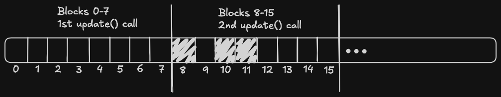

There's also a very good [article](https://asteri.sm/files/2024-06-01-nnue.html) about different optimizations.

## Lazy updates
Because we use a transposition table to store positions' evaluations, we don't need to evaluate some positions.
That means that we also don't have to know the accumulators' values.
So we can skip some accumulators' updates.

When we want to update our accumulators (when making a move), we can just push the update information (e.g. changed squares) into a stack (or pop when unmaking a move) and mark the current state of the accumulators as "dirty" ("dirty" means that the accumulators in this stack entry are unknown; "clean" means the opposite).
When we want to evaluate our position, we need to calculate the accumulators.
To do it, we find the last entry with "clean" accumulators and then go through the stack and apply all of the updates we stored (while also saving all the intermediate states because we might need them).
If you have some sort of net refreshing (e.g. mirroring/king buckets), you can also save this info instead of actually recalculating the net, and calculate it only when you actually need it (tip: you can mark the state right before the current one as "clean", because we don't need its accumulators, because we do a full accumulator refresh on current entry anyway).
###### Pseudocode:
```python
def make_move():
	...
	stack.push(updated_squares)
	
def unmake_move():
	...
	stack.pop()

...

accumStack[256][2N]

def update(i, updated_squares):
	accumStack[i + 1] = add(accumStack[i], updated_squares)

def clean_accumulators():
	for i in lastCleanAccNumber..currentAccNumber:
		update(i, stack[i])
	
def evaluate():
	clean_accumulators()
	...
```

## Sparse matrix multiplication
There are another good articles: [article 1](https://asteri.sm/files/2024-08-17-multilayer.html#sparse-matrix-multiplication), [article 2](https://rmeguro.com/blogs/sparse-nnue.html) on the same topic.

This technique only works for a multilayer network.
Because we're using SCReLU for the accumulators' activation, all negative values clamp to $0$, so after the activation a lot of values are $0$.
These zeros don't affect the values of the second hidden layer, so we can just skip them when computing it, which gives us a speedup.
However, if you just write
```c++
if (activated[i] == 0)
	continue;
```
you may even slow down the inference because it's quite computationally expensive to compute a condition.
Instead of this, we do a clever algorithm, which lets us compute all non-zero activation indexes.
##### Algorithm
When computing the matmul, we process 4 activations of the first hidden layer at once (let's call these 4 activations a "block").
We want to compute an array `int16_t nonzeroActivations[]`, which stores the **indices** of all nonzero blocks of 4 activations.

First, we write a `int8_t nonzeroMask(__m256i x)` function, which gives us a mask of all nonzero blocks in m256 vector:
```c++
inline int8_t nonzeroMask(__m256i x) {
        return _mm256_movemask_ps(_mm256_castsi256_ps(_mm256_cmpgt_epi32(x, _mm256_setzero_si256())));
    }
```
which is basically comparing each 32-bit block with $0$, and using `_mm256_movemask_ps` to get the mask.

We have a byte, and we want to quickly store all non-zero bit numbers in `nonzeroActivations`.
Turns out, we can just precompute an array `uint16_t byteIndex[256][8]`, which stores the indices (e.g. for 53 = 0b110101 `byteIndex[53] = {0, 1, 3, 5}`).
Then the whole algorithm is:
```c++
uint16_t nonzeroIndexes[K];
int nonzeroCount;
__m128i baseIdx;

void update(__m256i x) {
	int8_t mask = nonzeroMask(x);
	__m128i indexes = load(byteIndex[mask]);
	store(nonzeroIndexes[nonzeroCount], add(indexes, baseIdx));
	nonzeroCount += popcount(mask);
	baseIdx = add(baseIdx, m128_set(8));
}
```
We need the `baseIdx` vector because we compute 8 blocks at once.
So when we call update() the second time and we get indexes {0, 2, 3}, actually their indexes are {8, 10, 11}:



Then when evaluating instead of doing
```c++
for (int i = 0; i < K; i++) {
	compute_matmul(i);
}
```
we do
```c++
nonzeroCount = 0;
baseIdx = m128_set(0);

for (int i = 0; i < K; i++) {
	update(load(act[i]));
}

for (int i = 0; i < nonzeroCount; i++) {
	compute_matmul(nonzeroIndexes[i]);
}
```

#### Permuting
Imagine that you have two blocks: the first is $[1, 2, 0, 0]$ and the second is $[0, 0, 0, 3]$. Because both of them contain at least one non-zero element, they both need to be used to compute the matmul. However, if you permute them into $[1, 2, 3, 0]$ and $[0, 0, 0, 0]$, the second block now contains only zeroes, and we don't need to evaluate it. We should precompute the permutation, which will more likely group zero neurons together. To do that, you just evaluate a bunch of positions. For each position we look at the non-zero white accumulator neurons after its activation, and increment these neurons' counters:
```python
for i in 0..N-1:
	if white_act[i] != 0:
		nonzeroCounter[i] += 1
```
Then we sort `nonzeroCounter` in ascending order and take the permutation which puts the neurons into this order. By doing so, the neurons will be sorted in such order, so that the neurons which tend to have zero activation more often will come first. You don't need to compute the permutation for black because chess is symmetric for both colors and the best permutation for black will be the same. There can be other ways to find the permutation, but they usually don't produce a meaningful speedup.

Now that you have found a permutation, you just embed it in the code. When initializing the net, you permute the accumulator's neurons. To do this, you need to permute $w0$, $b0$, and $w1$ according to the found permutation. If you are doing pairwise, you need to account for it.

## Finny tables
If you've done input buckets, you can use an optimization called Finny tables. Let's imagine that during a search, white king goes from bucket 0 (let's call this position $pos_1$) to bucket 1, and then back to bucket 0 (and this position is $pos_2$). Let's assume we evaluated $pos_1$ earlier, and now we want to evaluate $pos_2$. Changing buckets forces us to fully recompute the accumulators. However, this is a very heavy operation, and we have a method to optimize it. 

$pos_1$ and $pos_2$ probably don't differ a lot from each other, and since we have evaluated $pos_1$'s accumulators, we can efficiently update the accumulators to $pos_2$. We make a structure which stores an accumulator for each possible scenario (this includes the accumulator's color, whether the board is mirrored, and king's bucket). Instead of fully recomputing the accumulator after bucket changes, we grab the accumulator with the same configuration as the current one, look at the differences between the positions, and apply the updates based on those differences:

```python

Table {
	int accumulator[N]
	
	Board lastBoard
	
	def update(newBoard):
		for square in changedSquares(lastBoard, newBoard):
			accumulator.applyEfficientUpdate(square)
		
		lastBoard = newBoard
}

Table finnyTables[2][2][inputBuckets]


def fullAccumRecompute(board, accumColor):
	finnyTables[accumColor][board.isMirrored(accumColor)][board.bucket(accumColor)].update(board)

```

Note that you don't need to copy the full board, all you need is bitboards that encode the pieces like `whitePieces`, `kings`, `queens` etc.
